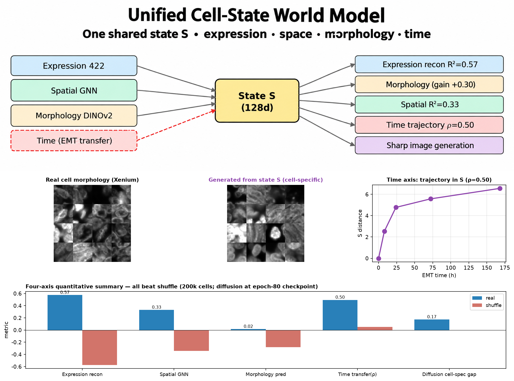

<h1 align="center">Cell-State World Model</h1>

<p align="center">
  <a href="LICENSE"></a>
  
  
  
</p>

<p align="center">
  <strong>One state to draw them all.</strong><br/>
  A single trained network in which one 128-dimensional latent state <strong>S</strong> is shared across expression,<br/>
  morphology, spatial context and time. You can read S out to any axis, roll it forward, intervene on it, and<br/>
  decode it back into a cell image. Every axis is validated against a shuffle / identity control.
</p>

<h3 align="center"><a href="#getting-started"><ins>Getting started</ins></a> · <a href="report/unified_paper_full.pdf">Read the technical report (PDF)</a></h3>

<p align="center">
  
</p>

**Author:** Yuchan Lee · **Event:** Built with Claude — Life Sciences Hackathon (Researcher Track), built end-to-end during the event with Claude Science.

Single-cell biology is fragmented: expression, morphology, spatial context and time are measured on different platforms with no shared coordinate system. A cell, though, is a dynamical system with one hidden state (its regulatory program); the four measurements are four windows onto it. This project treats S as a proper world model. To our knowledge it is the first cell model to hold all four axes in one intervenable, generative state: the virtual-cell field today (Arc STATE 167M cells, CZI TranscriptFormer 112M, scGPT, GeneFlow, Spatia) is single-modality transcriptomics predicting perturbation → expression. The individual blocks (CFG, DINOv2, GNN, FiLM) are adapted from known work; the contribution is the fusion, and proving each axis real with an adversarial negative control rather than asserting it.

## Features

<table>
<tr>
<td width="50%" valign="middle">

### One encoder, four readouts

A shared encoder (422 → 512 → 256 → 128) maps a cell's expression into S. Three heads decode S back out: expression reconstruction, morphology (a DINOv2-384 embedding), and spatial context (neighbor → center via a GNN). They are trained jointly on 200,000 Xenium cells.

A classifier-free-guidance diffusion decoder, conditioned on S through FiLM at every resolution, then generates the cell's 64×64 DAPI image.

</td>
<td width="50%">
  
</td>
</tr>
<tr>
<td width="50%" valign="middle">

### Every axis beats a shuffled control

On held-out cells: expression R² 0.574 vs −0.574 shuffled, spatial R² 0.331 vs −0.343, morphology R² 0.016 vs −0.280 (gain +0.30), time transfer Spearman ρ 0.50 vs ~0, and a diffusion cell-specificity gap of +0.17 at guidance w = 3. Generated images are sharper than real ones (Laplacian energy 0.074 vs 0.032) while still matching their own cell better than a random one.

</td>
<td width="50%">
  
</td>
</tr>
<tr>
<td width="50%" valign="middle">

### Time is a transfer, and it holds

The frozen Xenium-trained encoder projects an independent EMT scRNA-seq time-course (GSE147405, A549 + TGFB1, 0d → 7d; 175 genes shared with the Xenium panel) into the same S. The cells trace a monotone trajectory away from the 0d centroid (ρ = 0.50, p < 1e-190); the shuffle control gives max |ρ| = 0.05.

</td>
<td width="50%">
  
</td>
</tr>
<tr>
<td width="50%" valign="middle">

### Knowing when a generated axis is real

An earlier raw-expression diffusion decoder produced sharp images that fit the wrong cell as well as the right one (MSE-to-true = MSE-to-shuffle = 0.100): sharp but hallucinated. The MSE decoder was blurry but correct. That comparison is shipped as a figure, and the S-conditioned decoder is reported by its cell-specificity gap, not its sharpness alone.

</td>
<td width="50%">
  
</td>
</tr>
<tr>
<td width="50%" valign="middle">

### S → morphology, cell by cell

The final decoder (epoch-80 checkpoint, w = 3) generates each held-out cell's morphology from S alone. Size and brightness track the real cell at r ≈ 0.66–0.68 against a shuffle control of −0.09. Morphology is a genuinely weak, many-to-one signal, so some generated cells remain blob-like; that is stated in the report rather than hidden.

</td>
<td width="50%">
  
</td>
</tr>
</table>

**Also included**

- **Sample endpoints on Modal**: a reference FastAPI deployment (`src/serve_app.py`, A10G, scale-to-zero) that encodes a held-out cell into S and generates its morphology at an adjustable guidance weight. Public instance: <https://alexlee--cell-world-model-demo-web.modal.run> (the first request after idle cold-starts in ~30–60 s).
- **Interactive workbench** (`workbench/`): describe a cell state in plain language, Claude turns it into a plan, the model generates the cell from S on a GPU; then scrub the state, intervene mid-trajectory, and annotate the image with questions Claude answers grounded in that cell's numbers. A local Node proxy keeps the Claude API key off the browser.
- **Full technical report** in LaTeX and PDF under `report/`, plus the hackathon summary and the demo video script.
- **All headline numbers as JSON** in `results/` (`unified_all_metrics.json`, training log, time-axis stats, held-out evaluation, guidance sweep).

---

## How it works

```text
10x Xenium colon-cancer sample (200k cells)          GEO GSE147405 (EMT time-course)
  expression 422 · DAPI 64×64 · (x,y) · DINOv2-384        175 shared genes
        │                                                        │
        ▼                                                        │
  Encoder E  422 → 512 → 256 → 128  ──────────►  shared state S (128-d)  ◄── frozen E (transfer)
        │                                             │
        ├─ head: expression recon  (R² 0.57)          ├─ time trajectory in S  (ρ 0.50)
        ├─ head: morphology / DINOv2 (gain +0.30)     │
        ├─ head: spatial GNN, neighbor → center (R² 0.33)
        └─ CFG diffusion U-Net, S → FiLM at every block ──► generated cell image (gap +0.17 @ w=3)

  serve_app.py (Modal, A10G) ◄── workbench proxy (Node :8787) ◄── React app (:5210) + Claude
```

1. **Data prep** (`src/01_data_prep_unified.py`). Range-downloads three members of the Xenium `_outs.zip` (cell-feature matrix, cells table, morphology OME-TIFF) straight from the 10x CDN into a Modal Volume, then extracts 64×64 DAPI patches, 422-gene expression, centroids and DINOv2 embeddings for 200k cells into `xenium_unified.npz`.
2. **Joint training** (`src/02_train_unified.py`). Trains the shared encoder with the three heads jointly on an A100, saves `unified_state_model.pt`, and precomputes S for every cell. Every head is scored against a shuffled control on held-out cells.
3. **Diffusion decoder** (`src/03_train_diffusion_S.py`). Freezes the encoder and trains a CFG DDPM U-Net conditioned on S (not raw expression) via FiLM at every resolution. Orphan-safe: an EMA checkpoint and progress JSON are committed to the Volume every few epochs.
4. **Sampling and evaluation** (`src/04_sample_diffusion_S.py`). Loads the latest checkpoint, sweeps guidance w = 0…5, and reports the cell-specificity gap (MSE-to-true vs MSE-to-shuffle) plus sharpness.
5. **Time transfer.** The frozen encoder from step 2 projects the EMT time-course into S; the trajectory statistics land in `results/unified_time_axis.json`.

<details>
<summary><strong>What the workbench does, and what the scrubber does not mean</strong></summary>

The browser only talks to the local proxy. The proxy calls Claude for `POST /api/interpret` (free text → plan JSON) and `POST /api/ask` (annotation replies grounded in the numbers), and relays `GET /api/cell | trajectory | intervene | generate` to the Modal endpoints. Every cell shown is generated by the real CFG decoder from S; there is no procedural renderer.

Intervention blends the state toward another cell from frame `at` onward with weight `strength`, then re-decodes; `strength = 0` reproduces the plain trajectory byte-for-byte.

Honest notes from `workbench/README.md`: the scrubber is a linear interpolation in S between two real cells, not a learned clock, so cells that appear to merge are a crossfade artifact. Text → cell maps the wording to a deterministic cell index and is not phenotype-aware yet. Cell ids index the 200,000-cell dataset and carry no phenotype meaning on their own. The first request cold-starts the GPU; after that, generation takes ~25 s and is deterministic.

</details>

---

## Tech stack

<p>
  <kbd>PyTorch&nbsp;2.1+</kbd> &nbsp; <kbd>NumPy</kbd> &nbsp; <kbd>SciPy</kbd> &nbsp; <kbd>pandas</kbd> &nbsp; <kbd>scikit-learn</kbd> &nbsp; <kbd>matplotlib</kbd> &nbsp;
  <kbd>DINOv2&nbsp;(ViT-S/14,&nbsp;torch.hub)</kbd> &nbsp; <kbd>tifffile&nbsp;+&nbsp;imagecodecs</kbd> &nbsp; <kbd>remotezip</kbd> &nbsp; <kbd>h5py</kbd> &nbsp;
  <kbd>Modal&nbsp;(A100&nbsp;/&nbsp;A10G)</kbd> &nbsp; <kbd>FastAPI</kbd> &nbsp;
  <kbd>React&nbsp;18</kbd> &nbsp; <kbd>Vite&nbsp;8</kbd> &nbsp; <kbd>Tailwind&nbsp;3</kbd> &nbsp; <kbd>Node&nbsp;proxy</kbd> &nbsp; <kbd>Claude&nbsp;API</kbd> &nbsp;
  <kbd>scanpy&nbsp;/&nbsp;scvi-tools&nbsp;/&nbsp;POT&nbsp;(legacy)</kbd>
</p>

---

## Getting started

**Prerequisites**

- Python 3.11 with the packages in `requirements.txt`. The four numbered scripts are written for a single A100-80GB on [Modal](https://modal.com) and read/write a persistent Modal Volume (`xenium-unified`); a Modal account is the practical way to run them.
- Node 18+ for the workbench, plus an Anthropic API key.

```bash
git clone https://github.com/yc9954/cell-state-world-model.git
cd cell-state-world-model
pip install -r requirements.txt

# The unified pipeline, in order (Modal, A100)
python src/01_data_prep_unified.py     # Xenium → xenium_unified.npz on the Volume
python src/02_train_unified.py         # encoder E + 3 heads, jointly → unified_state_model.pt + S
python src/03_train_diffusion_S.py     # S-conditioned CFG diffusion decoder
python src/04_sample_diffusion_S.py    # guidance sweep, cell-specificity gap, sharpness

# Sample endpoints (your own instance)
modal deploy src/serve_app.py
```

**Workbench**

```bash
cd workbench
npm install
cp .env.example .env      # add ANTHROPIC_API_KEY (.env is git-ignored)
npm run proxy             # terminal 1: harness proxy on :8787
npm run dev               # terminal 2: app on :5210
```

Try `an epithelial cell that undergoes EMT over time`; it produces a multi-frame trajectory, which enables both the scrubber and the intervention panel.

| Process | Port | Notes |
| --- | --- | --- |
| Workbench app (Vite) | `5210` | only ever talks to the proxy |
| Harness proxy (Node) | `8787` | holds the Claude key; relays to Modal. `PROXY_PORT` |
| Model endpoints (Modal) | — | `MODAL_BASE`, defaults to the public sample deployment |

| Variable | Default | What it does |
| --- | --- | --- |
| `ANTHROPIC_API_KEY` | — | Required by the proxy for interpret and ask. Never ships to the browser. |
| `ANTHROPIC_MODEL` | `claude-haiku-4-5-20251001` | Model used for plans and annotation answers. |
| `MODAL_BASE` | public sample deployment | Base URL of the encoder + decoder endpoints. |

**Data (all public)**

- Spatial / morphology / expression: 10x Genomics Xenium `Xenium_V1_Human_Colon_Cancer_P1_CRC_Add_on_FFPE` (307,762 cells, 422-gene panel, 6.5 GB morphology image). A 200k-cell subset is used.
- Time axis (transfer): GEO **GSE147405**, A549 TGFB1-induced EMT time-course (0d, 8h, 1d, 3d, 7d), 3,133 main-arm cells.

---

## Building and testing

```bash
cd workbench && npm run build      # tsc -b + vite build
```

There is no automated test suite. The scientific checks are the shuffle / identity controls computed inside the training and sampling scripts; their outputs are the JSON files in `results/`.

---

## Repository structure

| Path | What lives there |
| --- | --- |
| `src/01_data_prep_unified.py` … `04_sample_diffusion_S.py` | The unified pipeline in order: data prep, joint training, S-conditioned diffusion, sampling and evaluation. |
| `src/embed_dinov2.py`, `src/serve_app.py` | Self-supervised morphology embeddings; the Modal FastAPI sample endpoints. |
| `src/legacy/` | Earlier single-axis world-model components (time-series world model, decoder, cell-cell model, production diffusion). |
| `results/` | `unified_all_metrics.json` (all headline numbers), training log, time-axis stats, held-out eval, guidance sweep, and `figures/` (the report figures). |
| `report/` | `unified_paper_full.pdf` and its LaTeX source, `hackathon_summary.txt`, `demo_video_script.md`. |
| `docs/` | `worldmodel_final_report.md` (comprehensive write-up) and `unified_model_architecture.md` (design notes). |
| `workbench/` | React + Vite app (`src/`), the Node harness proxy (`server/proxy.mjs`), and its own README with architecture and honest notes. |
| `requirements.txt`, `LICENSE` | Python dependencies (core, imaging, optional legacy); MIT. |

---

## Project status

A hackathon research project (Built with Claude — Life Sciences Hackathon, Researcher Track). Stated plainly:

**Working today.** The four-script pipeline on Modal; a trained encoder with three heads and an S-conditioned CFG diffusion decoder; shuffle controls on every axis; the EMT time transfer; the public sample endpoints; the interactive workbench with plan, scrub, intervene and annotate.

**Known limitations** (from the report). Scale: 200k cells, one tissue, below frontier scale. Morphology is a weak, many-to-one signal and some generated cells remain blob-like. Correlation, not causation. Time is a transfer, not native 4D data. No absolute image metric such as FID; a cell-specificity gap is reported instead. The final diffusion run stopped at epoch 80/120 after the loss converged (~0.0233); all figures use the epoch-80 checkpoint.

**Related work.** On expression → image generation alone, **GeneFlow** (2025, FID 20.73, same Xenium platform) and **Spatia** (2025; 49 donors, 17 tissue types, 12 disease states, ~17M cell-gene training pairs; fuses morphology + expression + space) exceed this work in scale and absolute metrics. The niche here is the four-axis fusion with an honest control at every step.

---

## License

[MIT](LICENSE).
